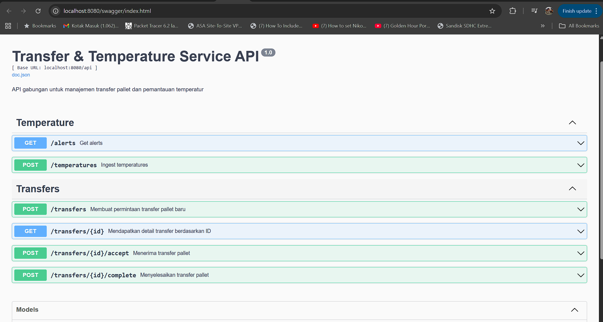

        # Transfer Service (combined Transfer + Temperature) - Single Gateway

        This repo runs Transfer and Temperature capabilities in one binary.

Run (Windows):
1. Ensure use lates Go version   go1.25.3
2. Ensure PostgreSQL is running and matches .env ( create database coldstorage before)
3. go mod tidy
4. go install github.com/swaggo/swag/cmd/swag@latest
5. swag init -g cmd/transfer-service/main.go -o docs
6. go run cmd/transfer-service/main.go


# 🧊 Cold Storage WMS — Perencanaan Arsitektur (MVP)

## 1. Konteks & Batasan Layanan

Sistem ini merupakan **Minimum Viable Product (MVP)** untuk operasi *Cold Storage Warehouse Management System (WMS)* yang mencakup tiga kapabilitas utama:

1. **Pallet Transfer Service**  
   Mencatat dan memproses perpindahan fisik *pallet* antar lokasi (slot/rack).

2. **Temperature Service**  
   Memonitor sensor suhu tiap *cold room* dan memicu *alert* bila melebihi ambang batas.

3. **Inventory/Stock Read Model (planned)**  
   Mengagregasi kuantitas per lokasi berdasarkan event `transfer.completed`.

Seluruh layanan dijalankan melalui satu gateway Go yang mengelola dua service utama:
- `/transfers` → endpoint terkait Pallet Transfer  
- `/temperatures` → endpoint ingest dan monitoring suhu

---

## 2. Service Boundaries

| Service | Fungsi Utama | Input | Output/Event |
|----------|---------------|-------|---------------|
| **Transfer Service** | Mengelola workflow transfer pallet | REST API `POST /transfers`, `POST /transfers/{id}/accept`, `POST /transfers/{id}/complete` | Event `transfer.created`, `transfer.accepted`, `transfer.completed` |
| **Temperature Service** | Mengelola data suhu dan deteksi alert | REST API `POST /temperatures`, `GET /temperatures/alerts` | Event `temperature.alert.raised` |
| **Inventory Service (planned)** | Mengagregasi stok on-hand per lokasi | Event `transfer.completed` | Queryable read model (per lokasi) |

---

## 3. API Contracts (ringkas)

### Transfer Service
| Method | Endpoint | Deskripsi |
|---------|-----------|-----------|
| `POST` | `/transfers` | Membuat permintaan transfer baru (dengan idempotency key) |
| `POST` | `/transfers/{id}/accept` | Supervisor menerima permintaan transfer |
| `POST` | `/transfers/{id}/complete` | Menyelesaikan proses transfer |
| `GET` | `/transfers/{id}` | Melihat status transfer |

### Temperature Service
| Method | Endpoint | Deskripsi |
|---------|-----------|-----------|
| `POST` | `/temperatures` | Menerima data suhu baru dari sensor |
| `GET` | `/temperatures/alerts` | Menampilkan alert aktif karena deviasi suhu |

---

## 4. Model Data (ringkas)

**Tabel `transfers`**
| Kolom | Tipe | Keterangan |
|--------|------|-------------|
| `id` | UUID | Primary key |
| `pallet_id` | VARCHAR | ID pallet |
| `from_location` | VARCHAR | Lokasi asal |
| `to_location` | VARCHAR | Lokasi tujuan |
| `status` | VARCHAR | ENUM: `created`, `accepted`, `completed` |
| `requested_by` | VARCHAR | Operator |
| `approved_by` | VARCHAR | Supervisor |
| `created_at` | TIMESTAMP | Waktu dibuat |
| `updated_at` | TIMESTAMP | Waktu update |

**Tabel `temperatures`**
| Kolom | Tipe | Keterangan |
|--------|------|-------------|
| `id` | UUID | Primary key |
| `room_id` | VARCHAR | ID ruang cold room |
| `value` | FLOAT | Suhu aktual |
| `threshold` | FLOAT | Ambang batas |
| `status` | VARCHAR | `normal` / `alert` |
| `timestamp` | TIMESTAMP | Waktu pembacaan |

---

## 5. Workflow & Reliability

- Menggunakan **Outbox Pattern**: event `transfer.completed` disimpan di tabel `outbox_events` sebelum dikirim ke broker atau diserialisasi ke file JSON.
- **Idempotency-Key** di header `POST /transfers` memastikan permintaan duplikat tidak menyebabkan double insert.
- Retry policy dengan exponential backoff (planned).
- Endpoint `/dev/flush-outbox` untuk simulasi pengiriman event.

---

## 6. Observability & Logging

- **Structured logging (JSON)** dengan [`zerolog`](https://github.com/rs/zerolog)
  - Log tersimpan di `logs/app.log`
  - Setiap request akan dicatat (method, path, durasi, status)
- **Metrics** dengan [`Prometheus`](https://github.com/prometheus/client_golang)
  - Endpoint `/metrics` menampilkan metrik latency dan error rate
- **Swagger/OpenAPI Docs**
  - Tersedia di endpoint: `/swagger/index.html`

---

## 7. Security & Configuration

- Konfigurasi disimpan di file `.env`

DB_HOST=localhost
DB_PORT=5432
DB_USER=postgres
DB_PASS=yourpassword
DB_NAME=coldstorage
SERVER_PORT=8080

- Validasi input dengan binding JSON pada endpoint.
- JWT Authorization (planned).
- Role-based endpoint (planned).

---

## 8. CI/CD & Testing Strategy

**Pipeline Ideal (MVP)**
lint → unit test → build binary → dockerize → deploy staging


**Testing Pyramid**
| Level | Tujuan | Tools |
|--------|---------|--------|
| Unit Test | Validasi logic service/repo | Go `testing` |
| Contract Test | Pastikan API sesuai OpenAPI | `swag` validation |
| Integration Test | DB dan event outbox | Docker Compose + Test DB |

---

## 9. Diagram Arsitektur (High-Level)

```mermaid
graph TD
    subgraph Gateway
        A[HTTP Router]
    end
    A --> B[Transfer Service]
    A --> C[Temperature Service]
    B -->|publish event| D[(Outbox Events)]
    B --> E[(PostgreSQL)]
    C --> E
    E --> F[Prometheus Metrics]
    A --> G[Swagger UI]
    B --> H[logs/app.log]


| Komponen                                  | Status | Catatan               |
| ----------------------------------------- | ------ | --------------------- |
| Clean Architecture (Handler–Service–Repo) | ✅      | Sudah diterapkan      |
| PostgreSQL Auto-Migration                 | ✅      | GORM digunakan        |
| Zerolog JSON + file log                   | ✅      | logs/app.log          |
| Prometheus metrics endpoint               | ✅      | /metrics              |
| Swagger/OpenAPI                           | ✅      | `/swagger/index.html` |
| Outbox event simulation                   | ✅      | `/dev/flush-outbox`   |
| Feature flag env var                      | ✅      | opsional via `.env`   |
| CI/CD pipeline                            | 🟡     | draft manual          |
| Unit test coverage                        | 🟡     | minimal               |


⚙️ Langkah Menjalankan di Windows (Local)

1.Buat database PostgreSQL

CREATE DATABASE coldstorage;

2. Masuk ke direktori proyek
cd transfer-service

3.Pastikan versi library Swagger sesuai
(agar tidak error undefined: swag.Spec)
go install github.com/swaggo/swag/cmd/swag@v1.8.12
go get github.com/swaggo/swag@v1.8.12
go get github.com/swaggo/http-swagger@v1.3.3

4.Unduh dependency
go mod tidy

 
5. Generate Swagger Docs
swag init -g cmd/transfer-service/main.go -o docs

6. Jalankan aplikasi
go run cmd/transfer-service/main.go

7. Akses endpoin
API utama: http://localhost:8080

Metrics Prometheus: http://localhost:8080/metrics

Swagger UI: http://localhost:8080/swagger/index.html

Log file: logs/app.log

Swagger


